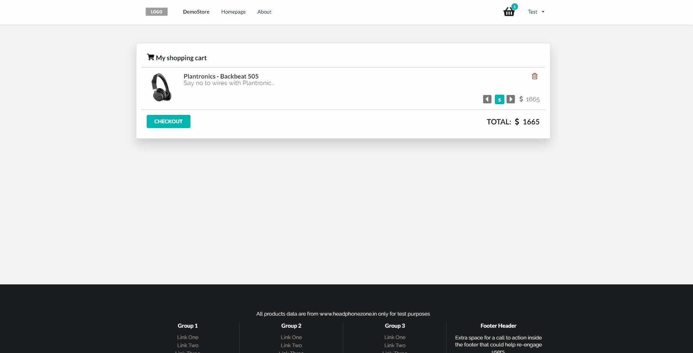
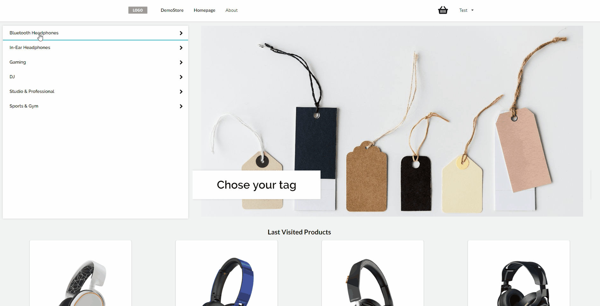
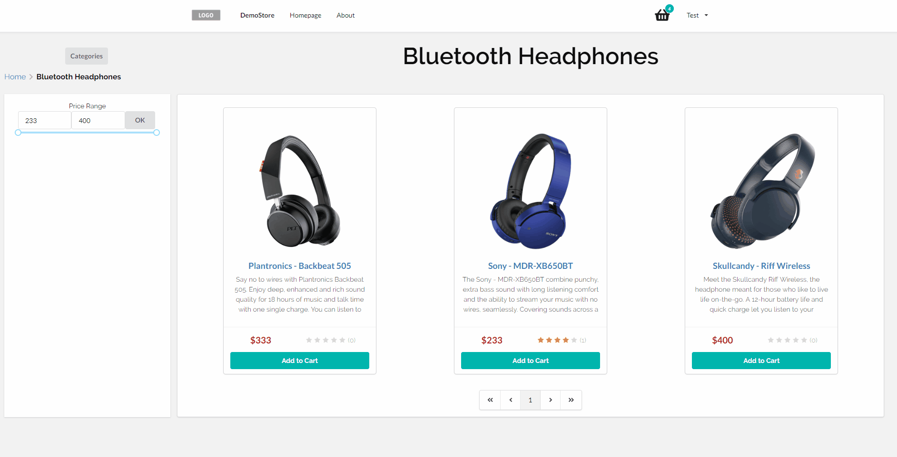

Demo - https://ecommerce-seo.herokuapp.com/

<h1>e-Commerce </h1>
<p align="center">
  
</p>

If you want run this app on your pc, first you must add variables to file [.env](.env) 

### For nodemailer settings:
```bash
EMAIL_USER=
EMAIL_PASS=
EMAIL_HOST=
```
About [Nodemailer](https://nodemailer.com).

### INSTALL NODE_MODULES:
```bash
$ yarn
```
### RUN ON PRODUCTION MODE:
```bash
$ yarn build
$ yarn start
```
Open http://localhost:3000 to view it in the browser.

### RUN ON DEVELOPMENT MODE:
```bash
$ yarn dev
```
Open http://localhost:3000 to view it in the browser.

## FEATURES
- User authentication.


- Ability to make order and also to view order history.


- Ability to view a list of products, sort by price and add to shopping cart.


- Ability to view product and leave feedback about the product.
